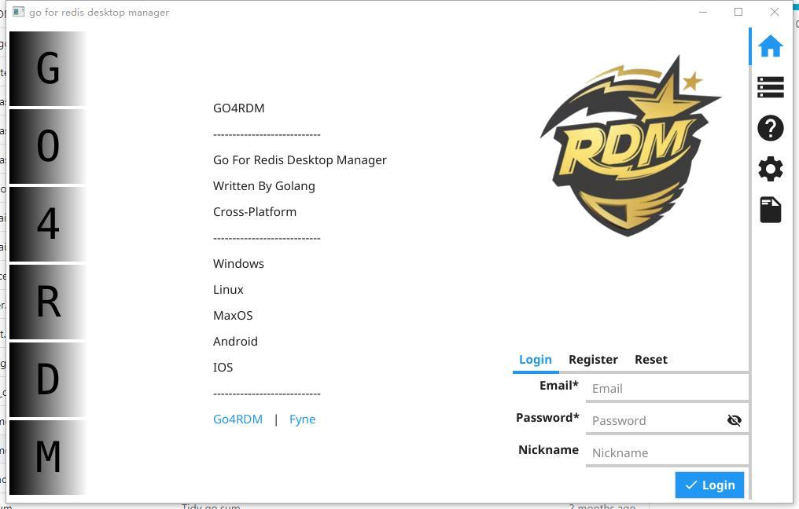
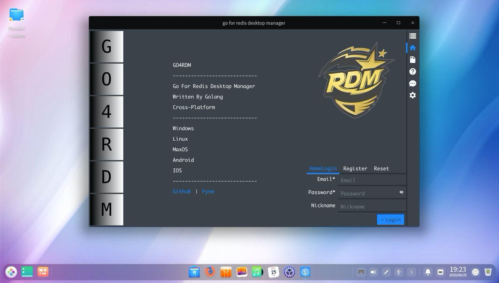
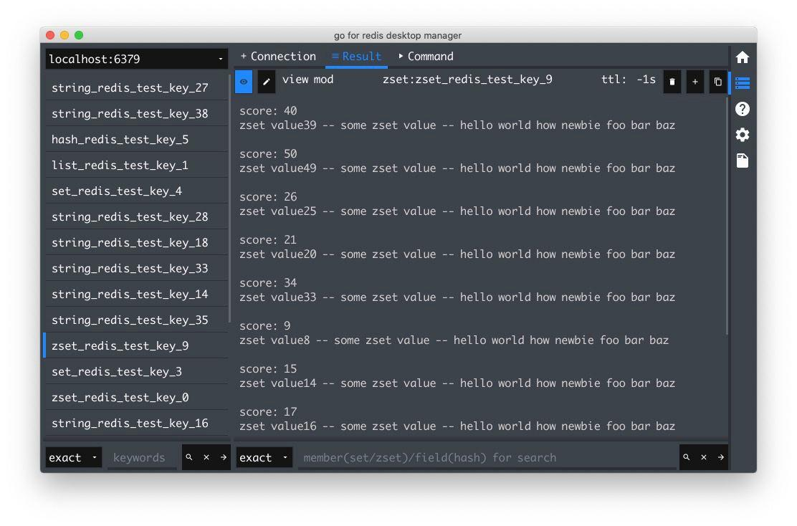
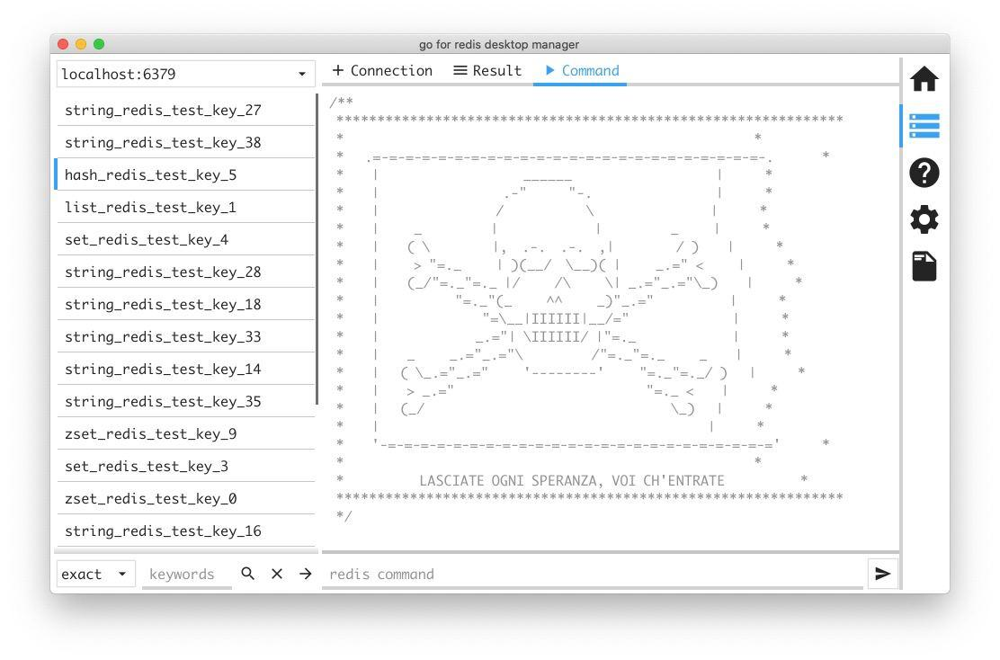
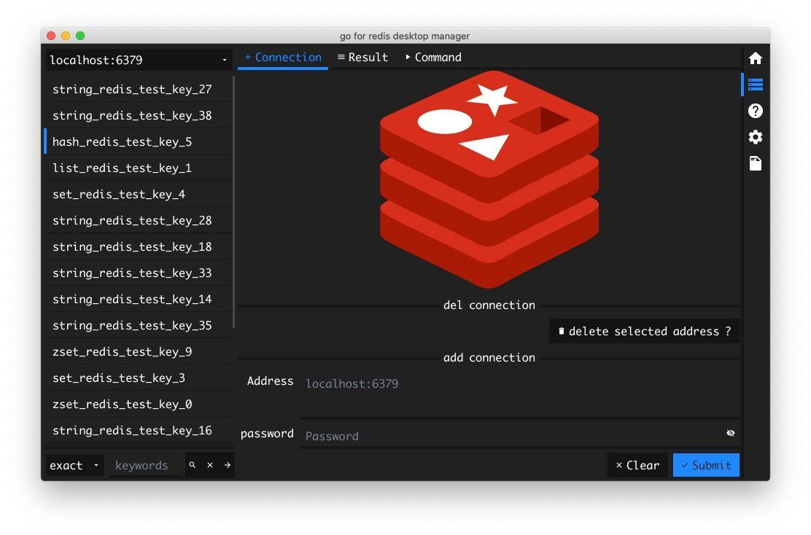
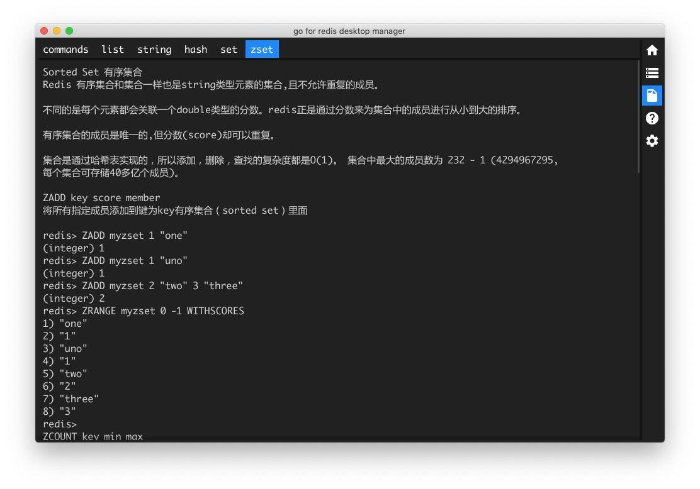
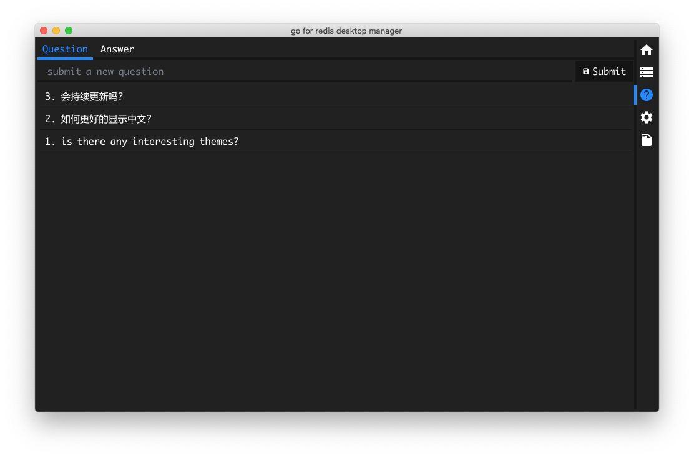
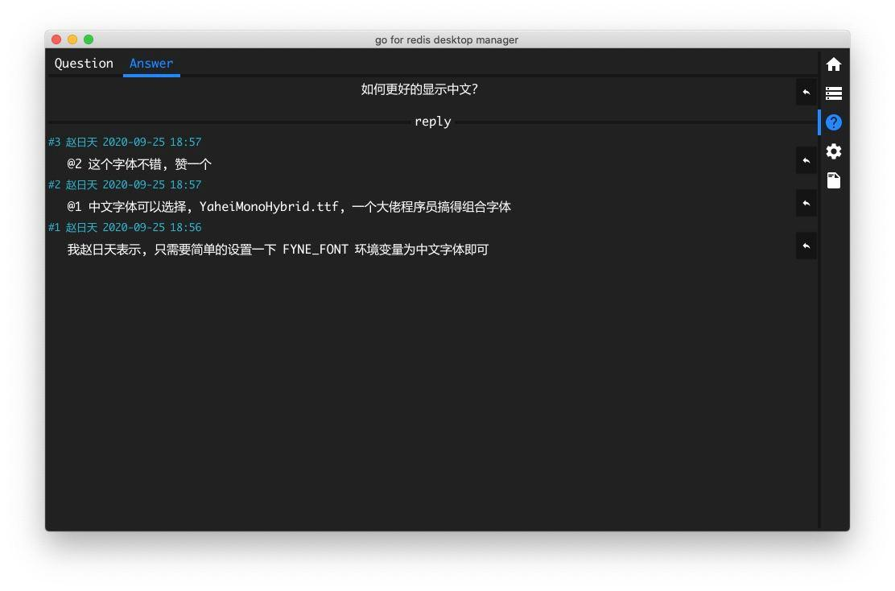

# go4rdm
go4rdm is golang for redis desktop manager, a cross-platform application written by golang and fyne gui framework

## install
1. install golang  
2. download ttf font for chinese support  
    https://github.com/maxsky/Yahei-Monaco-Hybrid-Font/raw/master/YaHeiMonacoHybrid.ttf
    ```sh
    curl -o YaHeiMonacoHybrid.ttf https://github.com/maxsky/Yahei-Monaco-Hybrid-Font/raw/master/YaHeiMonacoHybrid.ttf  
    ```
    then move to `~/Documents` directory  
    ```sh
    mv YaHeiMonacoHybrid.ttf ~/Documents
    ```
    or
    ```shell script
    export FYNE_FONT=/path/to/YaHeiMonacoHybrid.ttf  
    ```
3. download go4rdm  
```sh
go get -u github.com/gohouse/go4rdm
```

after download go4rdm, you can see the executable file in `${GOPATH}/bin` directory which named  
`go4rdm`(linux,mac) or `go4rdm.exe`(windows)  
just run it, you can see:  

## [click for big image view](./assets/readme.md)  

win | linux | mac  
---|---|---  
 |  |   
 |  |   
 |  |   
